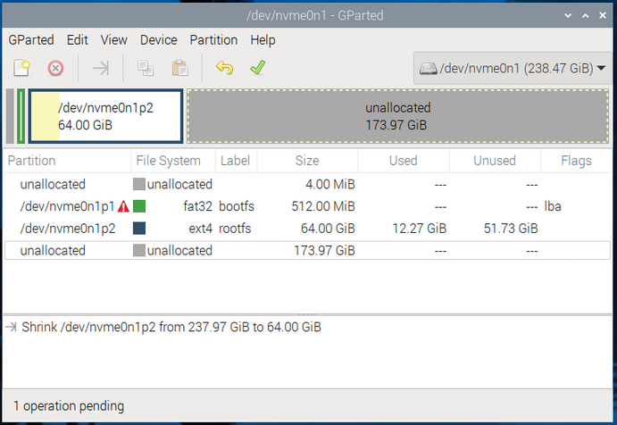
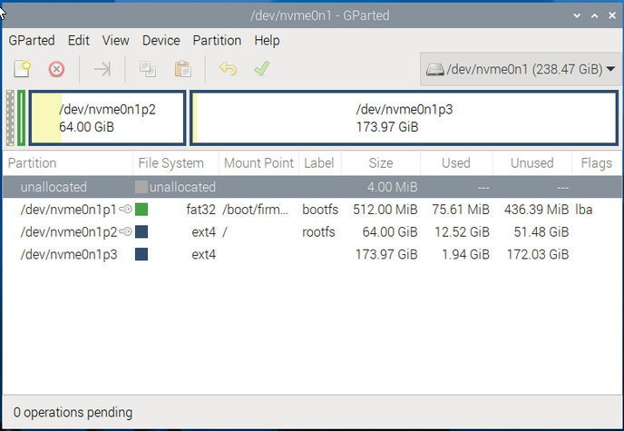
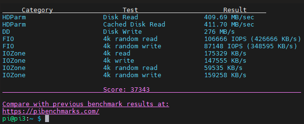
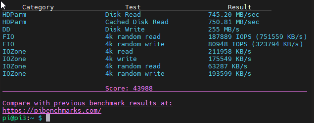

# Luks Encryption on NVMe Partition in PI5:

Encrypt Home Directory in Raspberry PI 5 NVMe.

The setup ment to have a sperate partition for the home directory in the same NVMe disk. 

## Description

Encrypting an NVMe drive on a Raspberry Pi is a good way to protect your data in case the drive is lost or stolen. You can use the Linux built-in encryption tools to achieve this. Here's a step-by-step guide to encrypt your NVMe drive on a Raspberry Pi.

To avoid removing the NVMe every time you install PI OS on it, I prepared the SD card, Install PI OS in it, I insert it (Pi will boot from SD by default) and then I can install PI OS on NVMe drive and partition it in the same time.

### Prepare and partition the NVMe:

You can prepare the NVMe from USB reader of course, It will be similar steps.





After that reboot and remove the SD card, the PI will automatically boot from NVMe.

### Check for updates:
```
sudo apt update
```

### Check for upgrades:
```
sudo apt upgrade
```

### Configure SSH & VNC:
```
sudo raspi-config
```

### Check for firmware update:
```
sudo rpi-eeprom-update
```

### edit `config.txt` to overclock PCIe from Gen2 to Gen3

```
sudo nano /boot/firmware/config.txt
```
`dtparam=pciex1`
`dtparam=pciex1_gen=3`
`arm_freq=3000`
`gpu_freq=1000`
`force_turbo=1`

Or use the below one line command to add the lines:

```
sudo grep -q "^dtparam=pciex1" /boot/firmware/config.txt || echo "dtparam=pciex1" | sudo tee -a /boot/firmware/config.txt > /dev/null; sudo grep -q "^dtparam=pciex1_gen=3" /boot/firmware/config.txt || echo "dtparam=pciex1_gen=3" || echo "arm_freq=3000" || echo "gpu_freq=1000" || echo  "force_turbo=1" echo | sudo tee -a /boot/firmware/config.txt > /dev/null
```

Below is a Benchmark test before/after overclicking the PCIe form Gen2 to Gen3.
Benchmark test using https://pibenchmarks.com/
```
sudo curl https://raw.githubusercontent.com/TheRemote/PiBenchmarks/master/Storage.sh | sudo bash
```
Photos show comparison before and after overclocking the PCIe form Gen2 to Gen3.




## Install Required Packages:
```
sudo apt-get install cryptsetup
```

## Partition the NVMe Drive: 
If the NVMe drive is not already partitioned, you can use a partitioning tool such as fdisk or parted to create partitions on the drive.

### Encrypt Partition:

```
sudo cryptsetup luksFormat /dev/nvme0n1p3
```


### Open the Encrypted partition:
```
sudo cryptsetup open /dev/nvme0n1p3 ennvme0n1p3
```

### Create File System:
```
sudo mkfs.ext4 /dev/mapper/nvme0n1p3
```

##Mount the Encrypted Partition:

Create a directory for mounting and mount the encrypted partition to your home directory:
```
sudo mkdir /mnt/envme0n1p3
sudo mount /dev/mapper/encrypted_home /mnt/nvme0n1p3

```
```
sudo chown pi:pi /mnt/nvme0n1p3/
```
```
chmod 600 /etc/p
```
```
sudo nano /usr/local/bin/script.sh
```
```
#!/bin/bash

# Path to the password file
PASSWORD_FILE="/etc/p"

# Command to unlock the encrypted partition
#sudo cryptsetup open --key-file "$PASSWORD_FILE" /dev/nvme0n1p3 nvme0n1p3
cat "$PASSWORD_FILE" | sudo cryptsetup open --type luks /dev/nvme0n1p3 nvme0n1p3

# Mount the unlocked partition
sudo mount /dev/mapper/nvme0n1p3 /mnt/nvme0n1p3   # Replace /mnt with your desired mount point
```
```
sudo nano /etc/systemd/system/unlock-and-mount.service
```
```
[Unit]
Description=Unlock and mount encrypted partition
After=network.target

[Service]
Type=oneshot
ExecStart=/usr/local/bin/script.sh

[Install]
WantedBy=multi-user.target
```
```
sudo chmod +x /usr/local/bin/script.sh
```
```
sudo systemctl enable unlock-and-mount.service
```
